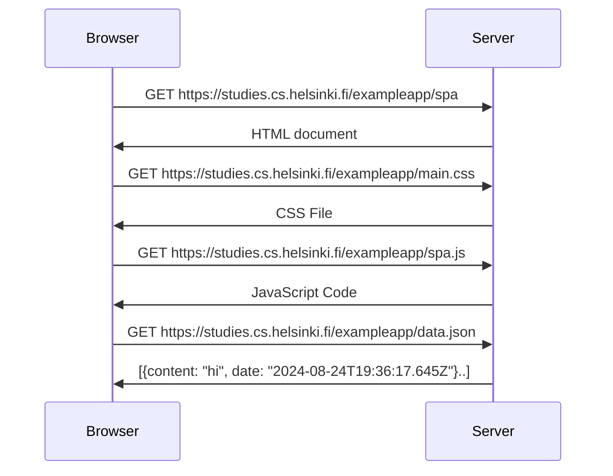

```mermaid
sequenceDiagram
    participant Browser
    participant Server
    Browser ->> Server: GET https://studies.cs.helsinki.fi/exampleapp/spa
    Server  ->> Browser: HTML document 
    Browser ->> Server: GET https://studies.cs.helsinki.fi/exampleapp/main.css
    Server  ->> Browser: CSS File
    Browser ->> Server: GET https://studies.cs.helsinki.fi/exampleapp/spa.js
    Server  ->> Browser: JavaScript Code 
    Browser ->> Server: GET https://studies.cs.helsinki.fi/exampleapp/data.json
    Server  ->> Browser: [{content: "hi", date: "2024-08-24T19:36:17.645Z"}..]
``` 
