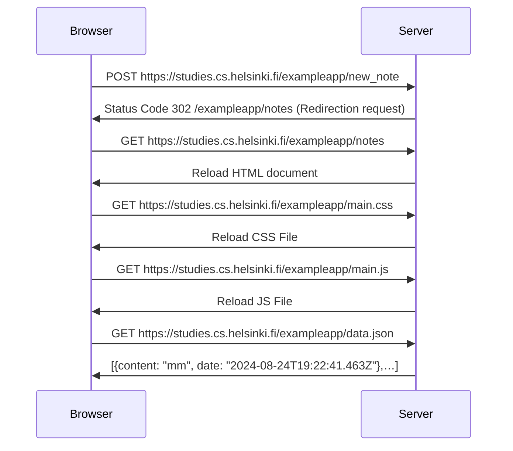

New Note

```mermaid
sequenceDiagram
    participant Browser
    participant Server
    Browser ->> Server: POST https://studies.cs.helsinki.fi/exampleapp/new_note
    Server  ->> Browser: Status Code 302 /exampleapp/notes (Redirection request)
    Browser ->> Server: GET https://studies.cs.helsinki.fi/exampleapp/notes
    Server  ->> Browser: Reload HTML document
    Browser ->> Server: GET https://studies.cs.helsinki.fi/exampleapp/main.css
    Server  ->> Browser: Reload CSS File
    Browser ->> Server: GET https://studies.cs.helsinki.fi/exampleapp/main.js
    Server  ->> Browser: Reload JS File
    Browser ->> Server: GET https://studies.cs.helsinki.fi/exampleapp/data.json
    Server  ->> Browser: [{content: "mm", date: "2024-08-24T19:22:41.463Z"},…]
    
    
```